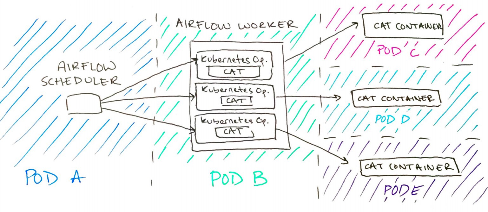

## Algorithm
[20. Valid Parentheses](https://leetcode.com/problems/valid-parentheses/)

题目描述：检查字符串中的括号是否正确匹配。

解题思路：最近重新看算法与数据结构，之后会按照书里介绍的算法顺序来刷题。这一题是栈的应用之一。从左到右遍历字符串，遇到左括号则入栈，否则出栈，检查是否与右括号匹配。如果最后字符串中的括号都正确匹配了，栈应该是空的。

源代码：[No_20](https://github.com/NickHdx/LeetCode/blob/master/src/main/java/com/nick/leetcode/No_20.java)

## Review
[We're All Using Airflow Wrong and How to Fix It](https://medium.com/bluecore-engineering/were-all-using-airflow-wrong-and-how-to-fix-it-a56f14cb0753)

在使用Airflow作为工作流管理工具时，会遇到下面3个问题：
1. 开发人员需要花费很多时间去熟悉众多的Operator，而且使用这些Operator容易产生bug。

2. 遇到问题的时候，Operator很难调试。

3. 各个Operator之间环境不独立，过于耦合。

文中给出了一种解决方案，对Operator进行进一步抽象——Kubernetes Operator，Kubernetes Operator执行一个Docker容器，实现业务逻辑的代码在Docker容器中运行。

## Tip

[Airflow: Lesser Known Tips, Tricks, and Best Practises](https://medium.com/datareply/airflow-lesser-known-tips-tricks-and-best-practises-cf4d4a90f8f)

使用Airflow的一些最佳实践。

## Share
[MEGAEASE的远程工作文化](https://coolshell.cn/articles/20765.html)

皓叔在文中介绍了自己创业公司的远程工作文化。最近因为疫情，也需要在家远程办公，读完受益匪浅。不管远程不远程，重要的是提高自己的职业素质和技术能力。
